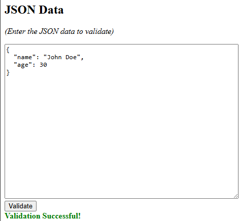

# JSON Validator


**JSON Validator** is a robust and modern web application designed to validate JSON data against JSON Schemas in real-time. Built with a focus on developer experience, it leverages **Webpack** for bundling, **Ajv** for high-performance validation, and a suite of quality assurance tools to ensure code reliability.

## Description

This project provides a clean, dual-pane user interface where developers can input a JSON Schema on one side and JSON Data on the other. The application instantly validates the data, providing precise feedback on errors or success. It serves as both a practical tool for schema testing and a demonstration of a modern JavaScript build pipeline.

**Key Features:**
* **Real-time Validation:** Instant feedback using the powerful Ajv library.
* **Detailed Error Reporting:** Highlights exactly which path and rule caused a validation failure.
* **Modern Build System:** Fully automated with Webpack 5.
* **Developer Tooling:** Integrated logging, static analysis, and unit testing.

## Visuals



## Installation

Follow these steps to get a development environment running:

**Prerequisites:**
* [Node.js](https://nodejs.org/) (v14 or higher recommended)
* npm (included with Node.js)

1.  **Clone the repository**
    ```bash
    git clone https://github.com/rensebastien/jsonValidator.git
    cd jsonValidator
    ```

2.  **Install dependencies**
    ```bash
    npm install
    ```

##  Usage

### Development
Start the local development server.
```bash
npm start
```


##  License
This project is licensed under the ISC License.